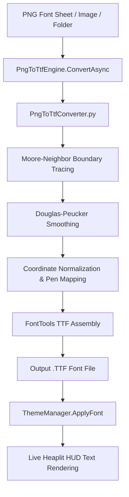

# 🔤 FontStudioOverlay & PngToTtfEngine Specification

The **Font Studio & Vectorizer Subsystem** provides automatic, on-demand conversion of raster PNG images, alphabet font sheets, glyph grids, and icon graphics into standards-compliant TrueType (`.ttf`) font binaries. It integrates directly into the Heaplit HUD command system, Media Converter Studio, and Visuals Typography calibration layer.



---

## 🏗️ Architecture & Component Roles

| Component | Layer | Description |
| :--- | :--- | :--- |
| [`PngToTtfEngine.cs`](file:///C:/Users/Kyle/Downloads/Projects/Heaplit/Modules/Layer0/Common/PngToTtfEngine.cs) | Layer 0 Core | Static async C# engine coordinating process execution, font file validation, and HUD font registration. |
| [`PngToTtfConverter.py`](file:///C:/Users/Kyle/Downloads/Projects/Heaplit/Modules/Layer0/Common/PngToTtfConverter.py) | Layer 0 Python | High-performance contour vectorizer and TrueType compiler using `fontTools` and `PIL`. |
| [`FontStudioOverlay.cs`](file:///C:/Users/Kyle/Downloads/Projects/Heaplit/Modules/Layer2/Media/FontStudioOverlay.cs) | Layer 2 UI | Glassmorphic HUD overlay featuring drag & drop, live binarization threshold sliders, and instant font preview. |
| [`FontStudioCommandHandler.cs`](file:///C:/Users/Kyle/Downloads/Projects/Heaplit/Modules/Layer3/Handlers/Media/FontStudioCommandHandler.cs) | Layer 3 Handlers | Command bar router matching queries: `font`, `png2ttf`, `png to ttf`, `fontstudio`, `make font`. |

---

## 💻 Technical Implementation Example

```csharp
using System;
using System.IO;
using System.Threading.Tasks;

namespace HeaplitLauncher
{
    public static class FontConversionExample
    {
        public static async Task GenerateAndApplyCustomFont(string pngSheetPath)
        {
            // Convert PNG font sheet to .TTF and apply to HUD
            bool success = await PngToTtfEngine.ConvertAndApplyToHeaplitAsync(
                pngSheetPath, 
                fontName: "CustomHexFont"
            );

            if (success)
            {
                TextOverlay.Show("✨ New font activated across all HUD overlays!", 3000);
            }
        }
    }
}
```

### 📘 Code Explanation & Technical Walkthrough
1. **`PngToTtfEngine.ConvertAndApplyToHeaplitAsync`**: Invokes the background Python process to trace vector contours and build the `.ttf` binary.
2. **`ThemeManager.ApplyFont`**: Updates the application resource dictionary (`GlobalFontFamily`, `ActiveFontFamily`, `BodyFontFamily`) and forces visual element invalidation for live text re-rendering.
3. **`TextOverlay.Show`**: Presents a feedback toast informing the user of successful compilation and application.

---

## 🔗 Related Notes
- [[MediaConverterOverlay]]
- [[HeaplitVisualsOverlay]]
- [[ThemeManager]]
- [[Welcome.md]]
